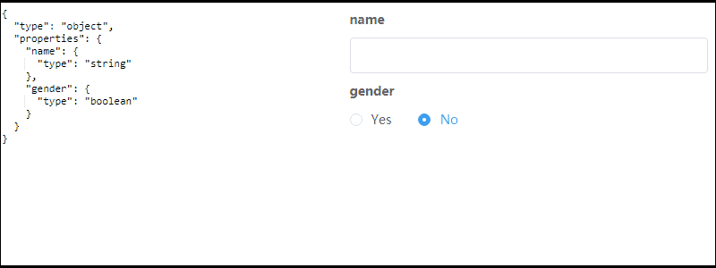
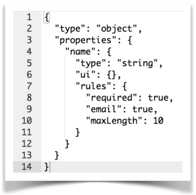
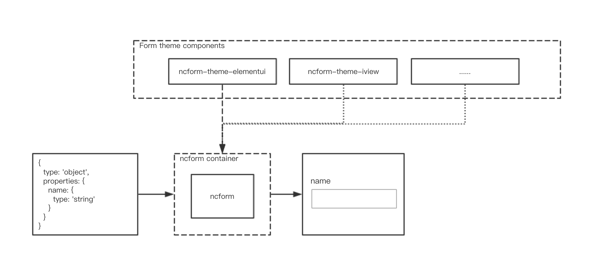

# ncform 

[](https://circleci.com/gh/ncform/ncform/tree/master)


[](https://dashboard.cypress.io/#/projects/enxoqt/runs)
[](https://gitter.im/ncform/community?utm_source=badge&utm_medium=badge&utm_campaign=pr-badge&utm_content=badge)
[](https://lernajs.io/)

[中文版](README_CN.md)



ncform, a nice form development way that generates form UIs and their interactions with just configuration.

Comes with **standard components** and **validation rules**, out of the box.

Have powerful **control interaction** and **extension capabilities**, do what you want.

> If you are hesitant, you can read this article: [How to choose](https://github.com/ncform/ncform/wiki/How-to-choose-a-project-that-generate-forms-from-a-JSON-schema)

[](https://ncform.github.io/ncform/ncform-show/playground/index.html)

---

- Table Of Contents
  - [Playground](#Playground)
  - [Quick Start](#Quick-Start)
    - [In node.js](#In-nodejs)
    - [In browser](#In-browser)
  - [Features](#Features)
  - [📄Documents](#Documents)
  - [Solve Pain Points](#Solve-Pain-Points)
  - [Repeat the wheel?](#Repeat-the-wheel)
  - [Why not use the standard json-schema?](#Why-not-use-the-standard-json-schema)
  - [dx expression](#dx-expression)
  - [Design Thinking](#Design-Thinking)
  - [Schema Generator](#Schema-Generator)
  - [❤️Sponsor](#Sponsor)

## Playground

Experience the charm of ncform on the [Playground](https://ncform.github.io/ncform/ncform-show/playground/index.html) to deepen your understanding of ncform

> [Playground](https://ncform.github.io/ncform/ncform-show/playground/index.html) shows the examples of ncform most of the use of the scene ( I believe the examples are the best document ), it is recommended to carefully browse the examples, the configuration of the examples can be used directly in the actual development

## Quick Start

### In node.js

1.install
```
npm i @ncform/ncform @ncform/ncform-common --save
npm i @ncform/ncform-theme-elementui element-ui axios --save 
```

2.import
```
import Vue from 'vue';
import vueNcform from '@ncform/ncform';

import Element from 'element-ui';
import 'element-ui/lib/theme-chalk/index.css';
import ncformStdComps from '@ncform/ncform-theme-elementui';
import axios from 'axios';

Vue.use(Element);
Vue.use(vueNcform, { extComponents: ncformStdComps, /*lang: 'zh-cn'*/ });
window.$http = Vue.prototype.$http = axios;
```

3.usage
```
# demo.vue

<template>
  <div>
    <ncform :form-schema="formSchema" form-name="your-form-name" v-model="formSchema.value" @submit="submit()"></ncform>
    <el-button @click="submit()">Submit</el-button>
  </div>
</template>
<script>
export default {
  data () {
    return {
      formSchema: {
        type: 'object',
        properties: {
          name: {
            type: 'string'
          }
        }
      }
    }
  },
  methods: {
    submit () {
      this.$ncformValidate('your-form-name').then(data => {
        if (data.result) {
          console.log(this.$data.formSchema.value)
          // do what you like to do
        }
      })
    }
  }
}
</script>
```
You can refer to the [ncform-demo](https://github.com/daniel-dx/ncform-demo) project

### In browser

```
<html>

<head>
  <link rel="stylesheet" href="https://unpkg.com/element-ui@2.4.3/lib/theme-chalk/index.css">
</head>

<body>
  <div id="demo">
    <ncform :form-schema="formSchema" form-name="your-form-name" v-model="formSchema.value" @submit="submit()"></ncform>
    <el-button @click="submit()">Submit</el-button>
  </div>

  <script type="text/javascript" src="https://unpkg.com/vue/dist/vue.min.js"></script>
  <script type="text/javascript" src="https://unpkg.com/axios/dist/axios.min.js"></script>

  <script type="text/javascript" src="https://unpkg.com/@ncform/ncform-common/dist/ncformCommon.min.js"></script>
  <script type="text/javascript" src="https://unpkg.com/@ncform/ncform/dist/vueNcform.min.js"></script>

  <script type="text/javascript" src="https://unpkg.com/element-ui/lib/index.js"></script>
  <script type="text/javascript" src="https://unpkg.com/@ncform/ncform-theme-elementui/dist/ncformStdComps.min.js"></script>

  <script type="text/javascript">
    Vue.use(vueNcform, { extComponents: ncformStdComps, /*lang: 'zh-cn'*/ });

    // Bootstrap the app
    new Vue({
      el: '#demo',
      data: {
        formSchema: {
          type: 'object',
          properties: {
            name: {
              type: 'string'
            }
          }
        }
      },
      methods: {
        submit() {
          this.$ncformValidate('your-form-name').then(data => {
            if (data.result) {
              // do what you like to do
            }
          });
        }
      }
    });
  </script>
</body>

</html>
```

## Features

- Configuration generation: A JSON data structure completely describes the UI of a form and its interaction behavior, and the development of the form is completed.

- Flexible interaction: Form controls flexibly interact with each other with powerful `dx expressions`

- Standard components: ncform defines a standard set of form component configuration specifications that can meet more than 90% of your form development needs without extensions.

- Rich verification: ncform comes with more than ten commonly used verification rules to meet more than 90% of your form validation requirements

- Extended friendliness: Form components and validation rules can be flexible extended and provide tools to simplify extension work

- vueI18n compatible: ncform can use a Vue18N compatible object to resolve strings. 

## Documents

- [ncform config / props / api / event](./CONFIG.md)

- Standard Components [Preview Version](https://ncform.github.io/ncform/ncform-theme-elementui/index.html) | [Text Version](./STD-COMP.md)

- [Custom Form Controls And Validation Rules](./EXT-DOC.md)

- [I18N](./I18N.md)

## Solve Pain Points

Most of the features in the management system are not the query list, that is, the form.  
The development of the form is a boring, nutrient-free, high-consumption repetitive physical activity that takes time and effort.  
The interaction between the form controls and the validation rules of the form items are very easy to produce bugs.  
So, in order to improve the efficiency of form development, reduce bugs, improve form development specifications and robustness, and most importantly, improve the development happiness of developers, the project is born

## Repeat the wheel?

A similarly well-known scheme in the community  ( listed in the reference projects ) has one or more of the following problems:

1. Basically designed in accordance with json-schema, but it is not appropriate to use json-schmea to describe a form.

2. For the interaction between form items, complex verification logic, there is no good solution

3. Can't complete all the UI and interaction behavior of the form with just one configuration ( meaning the configuration can be stored )

4. The underlying components provided by default are not rich enough to cover the form components commonly used in actual development.

5. Long time no maintenance, code writing style is too old and is difficult to expand

6. Component extension problem: There is no friendly extension solution for the current hot component implementations like Vue and React. 

In order to solve the above problems, embarked on the road of making wheels. . .

## Why not use the standard json-schema?

Because json-schema is data-oriented rather than form (ui), it is not very friendly for declaring a form.

For a form, care about what the form items are, what the form items look like, what are the validation rules, all these are related to the fields. The most intuitive management is in one place

Come to a simple comparison:

- json-schema example：


- ncform example：



Json-schema for validation rules, declared in various places, not well managed. And ncform is concentrated in rules field. This design is also convenient for later development of form development IDE

## dx expression：

With `dx` expressions, you can get the value of the specified field with `{{$root.xxx}}` and then write your arbitrary logical expression with the native JS.

- Specify the attribute value in the object, for example：
```
disabled: 'dx: {{$root.person.age}} < 18'
```

- Specify the value of an item in the array, for example:
```
disabled: 'dx: {{$root.persons[0].age}} < 18'
```

- Specify the properties of the same item in the array, for example:
```
disabled: 'dx: {{$root.persons[i].age}} < 18'
disabled: 'dx: {{$root.persons[i + 1].age}} < 18'
```

- Access constant data in the global configuration, for example:

```
disabled: 'dx: {{$root.person.age}} === {{$const.max}}'

// The global configuration is as follows
globalConfig: {
  constants: { max: 18 }
}
```

> dx expressions can also be replaced with `function` :

function(formData, constData, selfData, tempData, itemIdxChain) { ... }

- formData: corresponds to `{{$root}}`. Form data
- constData: corresponds to `{{$const}}`. Constant data in global configuration
- selfData: corresponds to `{{$self}}`. Used only for `ui.preview.value`, which refers to its own value
- tempData: corresponds to `{{$temp}}`. Temporarily stored value
- itemIdxChain: useful only for array items, refers to the index path of the current array, such as [1, 0]

Some common examples are as follows:

```
// form data
disabled: function(formData) {
  return formData.person.age < 18;
}

// array item
disabled: function(formData, constData, selfData, tempData, itemIdxChain) {
  const [ i ] = itemIdxChain;
  return formData.persons[i].age < 18;
}

// global constants
disabled: function(formData, constData) {
  return formData.person.age < constData.max;
}
```

## Design Thinking

ncform = ncform container + ncform theme standard component



A system project generally uses a UI library (such as vue) and a UI implementation (such as elementui)
In order to live in peace with it, ncform's standard components can use the same UI implementation

The ncform Vue version provides the standard components of the elementui theme by default [[Click to view]](https://ncform.github.io/ncform/ncform-theme-elementui/index.html)

If you are a fan of iview, you can develop standard components of the iview theme by following the specifications of the ncform standard components.

Thought: "Throw in" the standard components of various themes into the ncform container, which is a nice tool for developing forms.

## Schema Generator

You can accelerate the speed of writing form schemas with [Schema Generator](https://ncform.github.io/ncform/ncform-show/schema-gen/index.html)

Also you can try the third-party vscode extension: [vscode-plugin-ncform-schema](https://github.com/F-loat/vscode-plugin-ncform-schema/)

## References

- [json-schema](http://json-schema.org/)
- [jsonform](https://github.com/joshfire/jsonform)
- [json-editor](https://github.com/jdorn/json-editor)
- [react-jsonschema-form](https://github.com/mozilla-services/react-jsonschema-form)
- [angular-schema-form](https://github.com/json-schema-form/angular-schema-form)

## Authors

- [Daniel.xiao](https://github.com/daniel-dx) : ncform designer and main implementer
- Kyle.lo : The implementer of the ncform form validation part and the main developer of the standard component

## Contributors

<table><tr><td align="center"><a href="https://github.com/daniel-dx"><br/><sub><b>daniel.xiao</b></sub></a><br/><a href="https://github.com/daniel-dx"title="Author">☺️</a></td><td align="center"><a href="https://github.com/Kyleloh"><br/><sub><b>Kyleloh</b></sub></a><br/><a href="https://github.com/Kyleloh"title="Developer">💻</a></td><td align="center"><a href="https://github.com/liuxuewei"><br/><sub><b>liuxuewei</b></sub></a><br/><a href="#financial"title="Financial supporter">💵</a></td></tr></table>

## Sponsor

ncform is an MIT licensed open source project and completely free to use. If it is useful for you, you can give me a cup of coffee :).

### One-time donation

[](https://paypal.me/danieldx666)

[](docs/images/wechat-pay.jpg)

[](docs/images/alipay-pay.jpg)

### Monthly support

[Become a backer or sponsor via Patreon](https://www.patreon.com/ncform)
